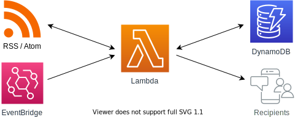

# lambda-feed-notifier
[](https://travis-ci.com/pohzipohzi/lambda-feed-notifier)
[](https://coveralls.io/github/pohzipohzi/lambda-feed-notifier?branch=main)

Scrapes rss/atom feeds and notifies configured recipients of new items via AWS Lambda. The Lambda function is triggered by an EventBridge scheduled rule, and notifications are deduplicated by caching feed items on DynamoDB. A CloudFormation template is provided to provision the required resources.

<p align="center">
  
</p>

## Cost

Costing depends on the time it takes to scrape and notify feeds, as well as the scraping interval. At the time of writing, scraping 5 feeds of around 10 items each and sending messages to a telegram bot every 5 minutes is within free tier.

## Deployment

This project leverages AWS's [Serverless Application Model (SAM)](https://docs.aws.amazon.com/serverless-application-model/) for deployment.

First configure Lambda environment variables in `template.yaml` (see comments in `Resources.LambdaFunction.Properties.Environment.Variables` for more information), then simply run:

```
CGO_ENABLED=0 sam build
sam deploy --guided
```
