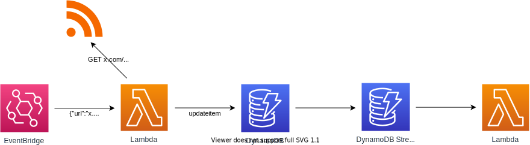

# lambda-feed-notifier
[](https://travis-ci.com/pohzipohzi/lambda-feed-notifier)
[](https://coveralls.io/github/pohzipohzi/lambda-feed-notifier?branch=main)

This is a simple AWS-based system that scrapes syndication feeds and writes feed items into a DynamoDB table via Lambda. The Lambda function can be set up to automatically trigger from scheduled rules configured on EventBridge. DynamoDB streams can be used in conjunction with other AWS services to do useful work on new feed items. A CloudFormation template is provided to provision the required resources.

<p align="center">
  
</p>

## Cost

At the time of writing, scraping 5 feeds every 5 minutes is safely within free tier. The author has no experience with more expensive setups.

## Deployment

This project leverages AWS's [Serverless Application Model (SAM)](https://docs.aws.amazon.com/serverless-application-model/) for deployment.

First configure `template.yaml`, then simply run:

```
CGO_ENABLED=0 sam build
sam deploy --guided
```
